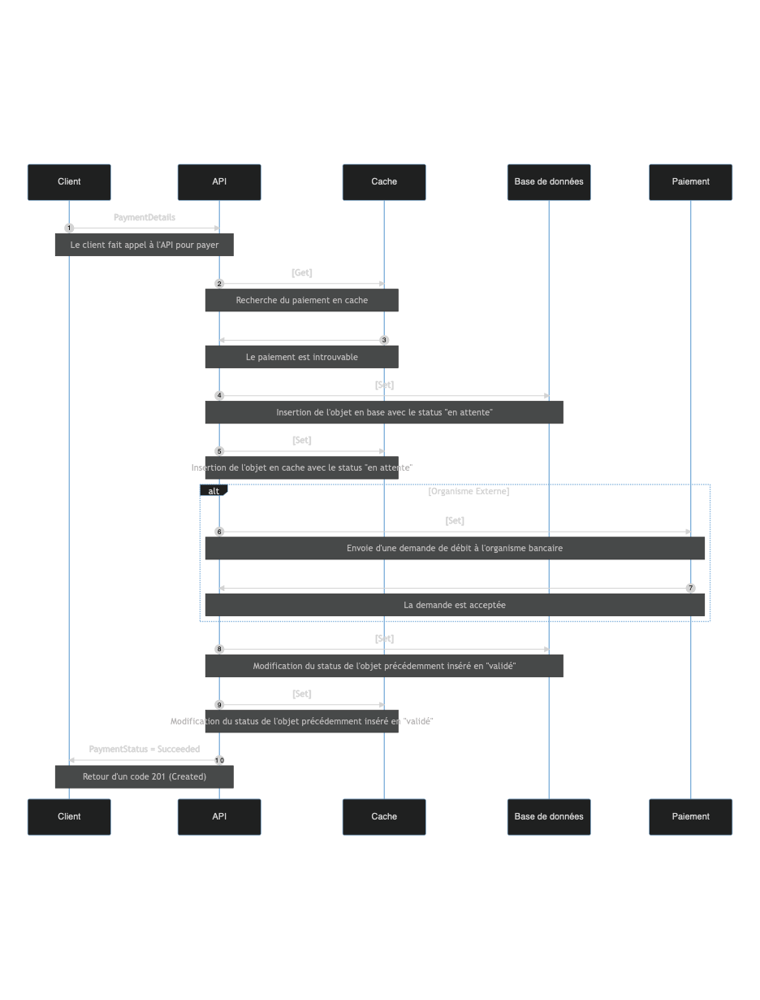
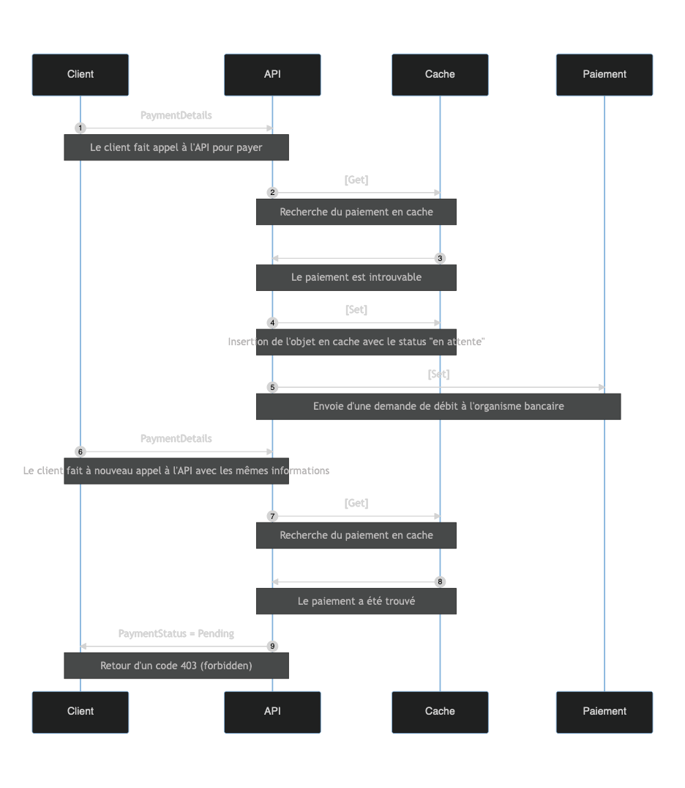
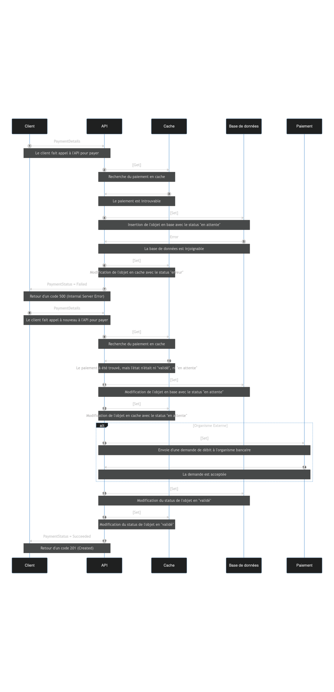

# CC2 Architecture Microservices

Bonjour monsieur ! Voici notre rendu pour le CC2
## Composition du groupe

- FLEURET Nathan
- YALAP Christophe
- OUSLIMANE Isaac
- ROUVILLE Quentin

## Diagrammes de séquence

### Le paiement se déroule correctement



### L’utilisateur souhaite effectuer un paiement déjà en cours (utilisation du cache)



### Une erreur survient lors du paiement (retry)



## Contrat Open API

```yaml
swagger: "2.0"
info:
  description: "Payment system"
  version: "1.0.0"
  title: "Payment API"
  termsOfService: "http://swagger.io/terms/"
  contact:
    email: "apiteam@swagger.io"
  license:
    name: "Apache 2.0"
    url: "http://www.apache.org/licenses/LICENSE-2.0.html"
host: "paymentAPI.swagger.io"
basePath: "/v2"
tags:
- name: "payments"
  description: "Operations about payments"
schemes:
- "https"
- "http"

securityDefinitions:
  ApiKeyAuth:
    type: apiKey
    in: header
    name: X-API-Key
  OAuth2:
    type: oauth2
    flow: accessCode
    authorizationUrl: https://example.com/oauth/authorize
    tokenUrl: https://example.com/oauth/token
    scopes:
      read: Grants read access
      write: Grants write access
      admin: Grants read and write access to administrative information

paths:
  /payments/credit-card:
    post:
      security:
        - ApiKeyAuth: []
      tags:
      - "payments"
      summary: "Process a payment"
      description: ""
      consumes:
      - "application/json"
      - "application/xml"
      produces:
      - "application/json"
      - "application/xml"
      parameters:
      - in: "body"
        name: "body"
        required: true
        schema:
          $ref: "#/definitions/PaymentDetails"
      responses:
        "200":
          description: "Successful payment"
          schema:
            $ref: "#/definitions/PaymentOutput"
        "400":
          description: "Invalid payment"
        "401":
          description: "Not authenticated"
          
  /payments/{id}:
    get:
      parameters:
        - name: id
          required: true
          in: path
          type: string
      security:
          - ApiKeyAuth: []
      responses:
        "200":
          description: "Payment details"
          schema: 
            $ref: "#/definitions/PaymentOutput"
      
definitions:
  PaymentDetails:
    type: "object"
    properties:
      paymentId:
        type: "string"
        example: pm_1L31tt2eZvKYlo2ChZQJXKWX
      billingDetails:
         $ref: "#/definitions/BillingDetails"
      creditCardInfo:
        $ref: "#/definitions/CreditCardInfo"
      amount:
        type: "number"
        format: "double"
        example: 150
      currency:
        type: "string"
        example: USD
  CreditCardInfo:
    type: "object"
    properties:
      cardNumber:
        type: "string"
        example: 4012888888881881
      cardOwner:
        type: "string"
        example: Jenny B
      expirationDate:
        type: "string"
        format: "date"
      cvv:
        type: "string"
  PaymentOutput:
    type: "object"
    properties:
      id:
        type: "string"
        example: pm_1L31tt2eZvKYlo2ChZQJXKWX
      
      paymentStatus:
        type: "string"
        description: "Payment Status"
        enum:
        - "succeded"
        - "processing"
        - "failed"
        - "refused"
  BillingDetails:
    type: "object"
    properties:
      address:
        $ref: "#/definitions/Adress"
      email:
        type: "string"
        example: jenny@example.com
      name:
        type: "string"
        example: jenny
      phone:
        type: "string"
        example: +15555555555
      
  Adress:
    type: "object"
    properties:
      city: 
        type: "string"
        example: Kianaport
      country:
        type: "string"
        example: QA
      line1:
        type: "string"
        example: 26781 Margarette Port
      postalCode:
        type: "string"
        example: 42105
      state:
        type: "string"
        example: South Dakota

```
